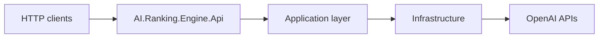
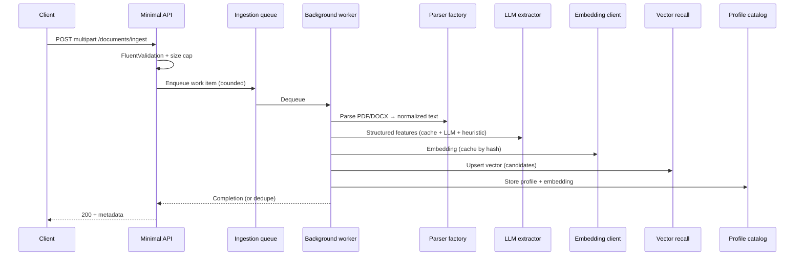
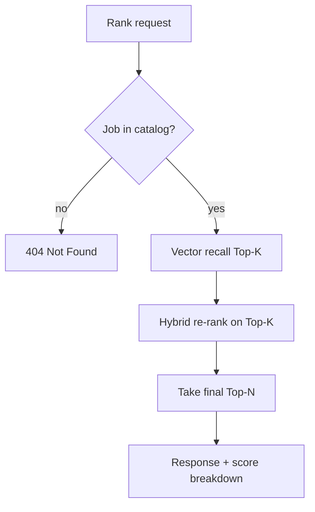

# AI-Ranking-Engine-Service — System Design

This document describes the **logical architecture**, **end-to-end data flow**, **scaling posture**, and **known failure modes** for the thin-slice AI-native ranking service. It complements `docs/IMPLEMENTATION-PLAN.md` and `docs/Known-Architectural-Decisions.md`, and aligns with the Architecture Decision Records in `docs/adr/`.

---

## 1. Purpose and scope

The service ingests **PDF** and **DOCX** documents (candidates and jobs), extracts **structured features** (LLM + heuristic fallback), computes **embeddings**, maintains an **in-memory vector index** for **Top-K recall**, and returns **Top N** candidates per job using **hybrid** scoring (semantic + deterministic signals). It is optimized for a **single deployable** process with **minimal external dependencies** beyond OpenAI APIs.

**In scope:** parsing, extraction, embedding, pure .NET recall, hybrid ranking, bounded ingestion queue, hash-keyed caching, validation, Problem Details errors.

**Explicitly out of scope (see ADRs and Known-Architectural-Decisions):** production auth/RBAC, rate limiting at the edge, durable multi-node queues, distributed cache, native ANN (FAISS), OCR for scanned PDFs, formal PII programs.

---

## 2. System context

- **Clients** call Minimal API endpoints for **document ingest** and **job ranking**.
- **OpenAI** provides **embeddings** and **chat-based structured extraction** (JSON), wrapped with **Polly** resilience.
- **No database** in v1: profiles and vectors live **in memory** for the process lifetime.

---

## 3. Logical layering

| Layer | Responsibility | Examples |
|-------|----------------|----------|
| **Domain** | Entities, value objects, pure ranking math, domain exceptions | `CandidateProfile`, `RankingWeights`, `ScoreBreakdown` |
| **Application** | Use cases, interfaces, FluentValidation, orchestration glue | `IDocumentIngestionPipeline`, `IHybridRankingService`, validators |
| **Infrastructure** | Parsers, OpenAI clients, cache, vector recall, ingestion channel | `OpenAIEmbeddingClient`, `InMemoryVectorRecall`, `ChannelIngestionQueue` |
| **Presentation** | Minimal API routes, DTOs, global exception handler | `DocumentIngestionAndRankingEndpoints`, `GlobalExceptionHandler` |

Dependency rule: **Domain** has no infrastructure references; **Application** depends on abstractions; **Infrastructure** implements them.

---

## 4. End-to-end pipeline (data flow)

### 4.1 Ingestion (candidate or job)

1. **Upload validation:** extension (PDF/DOCX), configurable **max size** (default 200 KB), entity id.
2. **Queue:** bounded **channel** applies **backpressure** when overloaded.
3. **Idempotency:** content-hash key avoids duplicate work; in-flight **single-flight** via `IIngestionIdempotencyStore`.
4. **Parse:** format-specific parser → **normalized plain text** (shared normalizer).
5. **Extract:** **LLM** JSON payload merged with **heuristic** features, validated (ranges, lists); **cache** by model + kind + text hash.
6. **Embed:** **OpenAI embeddings** with **in-process batching**; **cache** by model + dimensions + canonical text hash.
7. **Index:** candidate embeddings **L2-normalized** and stored in **`IVectorRecall`**; jobs stored in **catalog** with embedding for query.

### 4.2 Ranking (job → Top N candidates)

1. **Vector recall:** dot product on **normalized** query/candidate vectors (cosine similarity).
2. **Hybrid re-rank:** combine **semantic** component with **skill overlap**, **experience fit**, **keyword** signals using **configurable `RankingWeights`**.
3. **Output:** ordered list with **explainable** per-component breakdown.

---

## 5. Scaling strategy

| Dimension | Current behavior | When it breaks / next step |
|-----------|------------------|----------------------------|
| **Candidates N** | Linear **O(N)** scan per job query in one process | Latency/memory at very large N → **ADR** for ANN or external vector index |
| **Concurrent ingestion** | Bounded queue + worker; Polly for OpenAI | Sustained overload → **drop/shed** policy or external queue; see Known-Architectural-Decisions §1 |
| **Horizontal replicas** | **Independent** in-memory stores; **no** shared vector index or cache | Sticky sessions or **shared persistence** + distributed cache (future ADR) |
| **OpenAI quotas** | Retries, circuit breaker, queue depth | Cost/latency alerts; **Batch API** only for **offline** re-embed (future ADR) |

---

## 6. Trade-offs and assumptions

- **Cold start:** No click history; quality depends on **current** job text, extraction quality, and hybrid weights—not on learned rankers.
- **Determinism:** Same inputs and model ids yield **reproducible** scores; **embedding model changes** change geometry—**version model id in cache keys**.
- **Memory:** Footprint scales with **number of stored vectors × dimension × sizeof(float)** plus cache entries; long documents are **truncated** per extraction/embedding options.

---

## 7. Known failure modes

Honest production limitations and **degradation paths** (not an admission of unfixed defects—many are **scope boundaries**).

| Failure / risk | Symptom | Mitigation in codebase | Residual risk |
|------------------|---------|-------------------------|---------------|
| **Malformed or scanned PDF** | Empty/garbage text, poor features | PdfPig text extraction only; **no OCR** | Scanned resumes need future OCR ADR |
| **DOCX edge cases** | Parse errors | Open XML SDK; errors surface as failures | Unusual OOXML may fail |
| **LLM invalid JSON / refusal** | Parser returns null payload | **Heuristic fallback** + merge | Weaker structured features |
| **LLM hallucinated skills/years** | Implausible values | **Clamp**, validation, merge with heuristics | Taxonomy ambiguity remains |
| **Skill ambiguity** | “Java” vs “JavaScript”, synonyms | Normalization lists; hybrid reduces embedding-only reliance | Not a full HR ontology |
| **OpenAI rate limits (429)** | Transient failures | **Polly** retry + jitter; breaker | Queue backlog under sustained 429 |
| **OpenAI 5xx / timeout** | `ExternalServiceException` → 502/503 | Retries, timeout per attempt | Hard dependency on provider |
| **Empty candidate corpus** | Cannot rank | **Domain exception** / 400-style handling | Operational: ingest candidates first |
| **Process restart** | **Empty** vector index and catalog until re-ingest | Documented; no persistence in v1 | Cold start after deploy |
| **Stale cache** | Wrong embedding/extract after model change | Keys include **model id**; restart clears `IMemoryCache` | Multi-instance **divergence** if models differ |
| **Cache stampede** | Duplicate work on miss | `GetOrCreate` patterns where applicable; ingestion idempotency for same bytes | Hot keys still possible |
| **Single-instance cache** | No cross-replica coherence | Acceptable for single node | Scale-out needs **Redis** ADR |
| **Embedding model update** | Different similarity geometry | Version in cache keys; re-embed if product requires | Historical ranks not comparable across models |

---

## 8. Security and configuration (minimal scope)

- **Secrets:** environment variables and local **`.env`** (gitignored); no Key Vault in v1.
- **Uploads:** size cap and type allow-list; streaming read with **bounded** buffer pool where used.
- **No authentication** in this repository version—document as **required** for public exposure.

---

## 9. Observability

- **Structured logging** (`ILogger`) on extraction merge paths, ingestion, and failures.
- **Queue depth** returned on ingest response for **backpressure** visibility.
- **Metrics/tracing** (OpenTelemetry, Prometheus) deferred—see Known-Architectural-Decisions §9.

---

## 10. Related documents

| Document | Role |
|----------|------|
| `docs/IMPLEMENTATION-PLAN.md` | Phased roadmap and definition of done |
| `docs/Known-Architectural-Decisions.md` | Intentional trade-offs and scale-up alternatives |
| `docs/adr/*.md` | Decision history (see index below) |
| `README.md` | Build, test, run, configuration |

### ADR index (see files for full text)

| ADR | Topic |
|-----|--------|
| 0001 | ADR process |
| 0002 | Hybrid ranking baseline |
| 0003 | OpenAI embeddings — sync in-process batching (no Batch API) |
| 0004 | Pure .NET in-memory vector recall |
| 0005 | Hash-keyed `IMemoryCache` caching |
| 0006 | LLM structured extraction with heuristic fallback |
| 0007 | FluentValidation for API commands |
| 0008 | Offline ranking evaluation (NDCG, etc.) — deferred |

---

*This design matches the implementation as of Phase 8; update this document when behavior or scope changes materially.*
